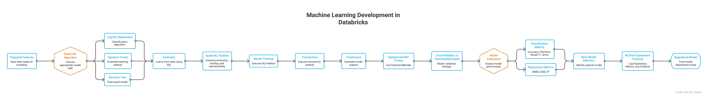

# Machine Learning Development in Databricks



## What You Must Know for the Exam

This module focuses on building, training, tuning, and evaluating ML models using Spark ML and Databricks ML capabilities. The most tested concepts are Pipelines, Estimators, Transformers, hyperparameter tuning, and model evaluation.

## 1. Transformer vs Estimator (Highest Priority)

This is one of the most common exam topics.

Transformer:
- Takes DataFrame as input
- Returns transformed DataFrame
- Uses `.transform()`
- Does not learn from data

Examples:
- VectorAssembler
- OneHotEncoderModel
- Trained Logistic Regression model

Estimator:
- Learns from data
- Uses `.fit()`
- Produces a Transformer

Examples:
- LogisticRegression
- RandomForestClassifier
- StringIndexer

Exam tip:

```text
Estimator -> fit() -> Transformer
Transformer -> transform() -> DataFrame
```

If a question asks, "Which component learns from data?", answer: Estimator.

## 2. Spark ML Pipeline (Very Important)

Instead of manually executing each ML step, Spark ML combines them into a pipeline.

Typical flow:

```text
Raw Data
    -> StringIndexer
    -> OneHotEncoder
    -> VectorAssembler
    -> Model Training
```

Example:

```python
from pyspark.ml import Pipeline

pipeline = Pipeline(
        stages=[
                indexer,
                encoder,
                assembler,
                lr
        ]
)
```

Benefits:
- Reproducibility
- Reusability
- Easier deployment
- Cleaner workflow

Exam tip:
- A Pipeline is a sequence of Transformers and Estimators working together as one workflow.

## 3. Model Training

Typical Spark ML workflow:

```python
model = algorithm.fit(train_df)
```

Common algorithms:
- Logistic Regression
- Random Forest
- Decision Tree
- Linear Regression

Exam tip:
- Training happens with `.fit()`.
- Prediction happens with `.transform()`.

## 4. Hyperparameter Tuning

Hyperparameters are configuration settings chosen before training.

Examples:

| Algorithm | Hyperparameter |
|---|---|
| Random Forest | `numTrees` |
| Logistic Regression | `regParam` |
| Decision Tree | `maxDepth` |

Goal:
- Find the best combination automatically.

## 5. ParamGridBuilder

Used to define candidate values.

Example:

```python
paramGrid = (
        ParamGridBuilder()
            .addGrid(lr.regParam, [0.01, 0.1])
            .addGrid(lr.maxIter, [10, 20])
            .build()
)
```

Exam tip:
- `ParamGridBuilder` does not train models.
- It only defines parameter combinations.

## 6. CrossValidator (Frequently Tested)

Cross-validation evaluates multiple parameter combinations.

Example:

```python
cv = CrossValidator(
        estimator=pipeline,
        estimatorParamMaps=paramGrid,
        evaluator=evaluator,
        numFolds=3
)
```

What happens:

```text
Dataset
    -> Split into folds
    -> Train multiple models
    -> Compare results
    -> Choose best model
```

Benefits:
- Better generalization
- Reduced overfitting
- More reliable model selection

Exam tip:
- CrossValidator is more accurate but slower.

## 7. TrainValidationSplit

Alternative to CrossValidator.

```text
Train Set
    -> Validation Set
    -> Select Best Model
```

Comparison:

| Feature | TrainValidationSplit | CrossValidator |
|---|---|---|
| Speed | Faster | Slower |
| Accuracy | Lower | Higher |
| Resource Usage | Less | More |

Exam tip:
- If scenario mentions faster experimentation or less compute, choose TrainValidationSplit.
- If accuracy is the priority, choose CrossValidator.

## 8. Model Evaluation

Evaluate model performance after training.

Common evaluators:

Classification:
- Accuracy
- Precision
- Recall
- F1 score
- AUC

Regression:
- RMSE
- MAE
- R2

Exam tip:
- Match metric to problem type:
    - Classification -> Accuracy / F1 / AUC
    - Regression -> RMSE / MAE / R2

## 9. MLflow Integration

Databricks automatically integrates with MLflow for experiment tracking.

Tracks:
- Parameters
- Metrics
- Models
- Artifacts

Benefits:
- Experiment comparison
- Reproducibility
- Model lifecycle tracking

Exam tip:
- Many recent exam takers report MLflow and Spark ML pipelines as heavily tested topics.

## Common Exam Confusions

| Concept A | Concept B | Difference |
|---|---|---|
| Estimator | Transformer | Learns vs applies |
| `fit()` | `transform()` | Train vs predict |
| Pipeline | Model | Workflow vs trained artifact |
| ParamGridBuilder | CrossValidator | Define params vs evaluate params |
| CrossValidator | TrainValidationSplit | Accuracy vs speed |

## Minimal Working Example

```python
from pyspark.ml import Pipeline
from pyspark.ml.classification import LogisticRegression
from pyspark.ml.tuning import CrossValidator, ParamGridBuilder

lr = LogisticRegression()

pipeline = Pipeline(stages=[assembler, lr])

paramGrid = (
        ParamGridBuilder()
            .addGrid(lr.regParam, [0.01, 0.1])
            .build()
)

cv = CrossValidator(
        estimator=pipeline,
        estimatorParamMaps=paramGrid,
        evaluator=evaluator,
        numFolds=3
)

model = cv.fit(train_df)
```

This single example covers:
- Pipeline
- Estimator
- Transformer
- Hyperparameter tuning
- Cross-validation
- Model training

## 30-Second Revision

```text
Prepare Features
    -> Build Pipeline
    -> Choose Algorithm
    -> fit()
    -> Hyperparameter Tuning
    -> CrossValidator / TrainValidationSplit
    -> Evaluate Model
    -> Track with MLflow
```

## If You Remember Only 3 Things

1. Estimator -> fit() -> Transformer
2. Pipeline = Multiple ML stages combined into one workflow
3. CrossValidator = More accurate, TrainValidationSplit = Faster

These three concepts alone account for a significant portion of Spark ML and Machine Learning Development questions seen by candidates preparing for the Databricks Machine Learning Associate exam.