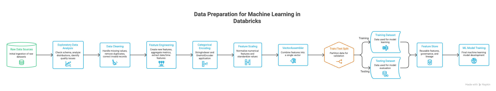

# Module 1: Data Preparation for Machine Learning in Databricks



## What You Really Need to Remember for the Exam

This module is not about building models. It is about ensuring the data is ready for machine learning. Most exam questions focus on how Databricks helps you explore, clean, transform, and manage features before training.

## 1. Exploratory Data Analysis (EDA)

Before training any model, understand your data.

Typical checks:
- Schema and data types
- Missing values
- Basic statistics
- Data distribution
- Outliers

Common commands:

```python
df.printSchema()
df.describe().show()
df.summary().show()
```

Exam tip:
- If the goal is to understand data quality or identify issues before training, the answer is usually EDA.

## 2. Missing Value Handling

Machine learning models generally perform poorly when important fields contain null values.

Common approaches:
- Drop records.

```python
df = df.na.drop()
```

- Fill missing values.

```python
df = df.na.fill({
    "age": 0,
    "salary": 0
})
```

Exam tip:
- Always perform missing-value handling before model training.

## 3. Encoding Categorical Data

Machine learning algorithms work with numbers, not strings.

Example categories:
- HR
- IT
- Finance

Convert text into numerical values.

StringIndexer:

```python
from pyspark.ml.feature import StringIndexer

indexer = StringIndexer(
    inputCol="department",
    outputCol="department_idx"
)
```

OneHotEncoder:
- Used when categories should not imply ranking.

Exam tip:
- Know the difference:
  - StringIndexer -> Category to integer
  - OneHotEncoder -> Category to binary vector

## 4. Feature Scaling

Features may have very different ranges.

Example:

| Age | Salary |
|---|---|
| 25 | 50000 |
| 40 | 200000 |

Salary dominates age because of scale.

```python
from pyspark.ml.feature import StandardScaler
```

Exam tip:
- Scaling becomes important when distance-based algorithms are used.

## 5. VectorAssembler (Very Important)

Spark ML expects all features inside a single vector column.

Without VectorAssembler, most Spark ML algorithms cannot train.

```python
from pyspark.ml.feature import VectorAssembler

assembler = VectorAssembler(
    inputCols=["age", "salary"],
    outputCol="features"
)
```

Output example:

```text
[25, 50000]
```

Exam tip:
- If a question asks how multiple columns become ML features, the answer is usually VectorAssembler.

## 6. Train-Test Split

Separate data into:
- Training dataset
- Testing dataset

Example:

```python
train_df, test_df = df.randomSplit(
    [0.8, 0.2],
    seed=42
)
```

Common ratios:
- 80/20
- 70/30

Exam tip:
- Testing data must remain unseen during model training.

## 7. Feature Engineering

Feature engineering creates better inputs for models.

Examples:
- Extract month from timestamp
- Calculate customer age
- Create purchase frequency
- Aggregate transaction counts

The course specifically emphasizes feature engineering as a core data-preparation activity.

Simple example:

```python
from pyspark.sql.functions import year, current_date

df = df.withColumn(
    "customer_age",
    year(current_date()) - df.birth_year
)
```

Exam tip:
- Better features often improve models more than changing algorithms.

## 8. Feature Store (Highest Exam Priority)

A Feature Store is a centralized repository for storing and reusing features across ML projects.

Benefits:
- Reusability
- Consistency
- Governance
- Lineage
- Sharing across teams

Workflow:

```text
Raw Data
  -> Feature Engineering
  -> Feature Store
  -> Model Training
  -> Inference
```

Databricks Feature Store uses Delta tables and tracks feature metadata and lineage.

Most important point:
- Feature Store stores features, not models.

Many exam questions try to confuse:

| Component | Stores |
|---|---|
| Feature Store | Features |
| MLflow Model Registry | Models |

## What Is Most Likely to Appear in the Exam?

- EDA
- Missing value handling
- StringIndexer
- OneHotEncoder
- VectorAssembler
- Train-test split
- Feature engineering
- Feature Store

Community feedback from recent exam takers consistently mentions feature engineering, Spark ML pipelines, Feature Store, and ML workflows as heavily tested areas.

## 30-Second Revision Before the Exam

```text
Explore Data
  -> Handle Missing Values
  -> Encode Categories
  -> Scale Features
  -> VectorAssembler
  -> Train-Test Split
  -> Feature Engineering
  -> Feature Store
  -> Model Training
```

## If You Remember Only 3 Things

1. Spark ML requires a features vector (VectorAssembler).
2. Categories are encoded using StringIndexer or OneHotEncoder.
3. Feature Store stores reusable features, not models.

## Final Summary

### Structure to Follow

#### 1. What You Must Know

Only include the 5-8 highest-value concepts from the module.

Example for data preparation:
- EDA (Exploratory Data Analysis)
- Missing value handling
- StringIndexer
- OneHotEncoder
- VectorAssembler
- Train-test split
- Feature engineering
- Feature Store

#### 2. Common Exam Confusions

Focus on concepts that are frequently mixed up.

| Concept 1 | Concept 2 | Key Difference |
|---|---|---|
| StringIndexer | OneHotEncoder | Integer encoding vs binary vector |
| Feature Store | Model Registry | Stores features vs stores models |
| Training data | Test data | Seen vs unseen data |
| Estimator | Transformer | Learns vs applies |

Feature Store is specifically designed for feature management and reuse, while Model Registry manages model lifecycle and versions.

#### 3. Minimal Working Example

Use only one small code snippet that demonstrates the most important concept.

```python
from pyspark.ml.feature import StringIndexer, VectorAssembler

indexer = StringIndexer(
    inputCol="department",
    outputCol="department_idx"
)

assembler = VectorAssembler(
    inputCols=["age", "salary"],
    outputCol="features"
)
```

The objective is recognition, not implementation mastery.

#### 4. What Databricks Wants You to Remember

Instead of documenting every feature, focus on exam-level understanding.

Example:
- Spark ML requires a features vector.
- Categories must be encoded before training.
- Features can be reused across projects through Feature Store.
- Feature tables are backed by Delta tables and require a primary key in Unity Catalog-based Feature Store workflows.

#### 5. 30-Second Revision

Create a visual flow.

```text
Raw Data
  -> EDA
  -> Clean Data
  -> Encode Categories
  -> Feature Engineering
  -> VectorAssembler
  -> Train-Test Split
  -> Feature Store
  -> Model Training
```

This mirrors the workflow emphasized in Databricks Data Preparation training.

#### 6. If You Remember Only 3 Things

Always end every module with this section.

Example:
1. Spark ML expects a features vector.
2. Categories are converted using StringIndexer or OneHotEncoder.
3. Feature Store stores reusable features, not models.